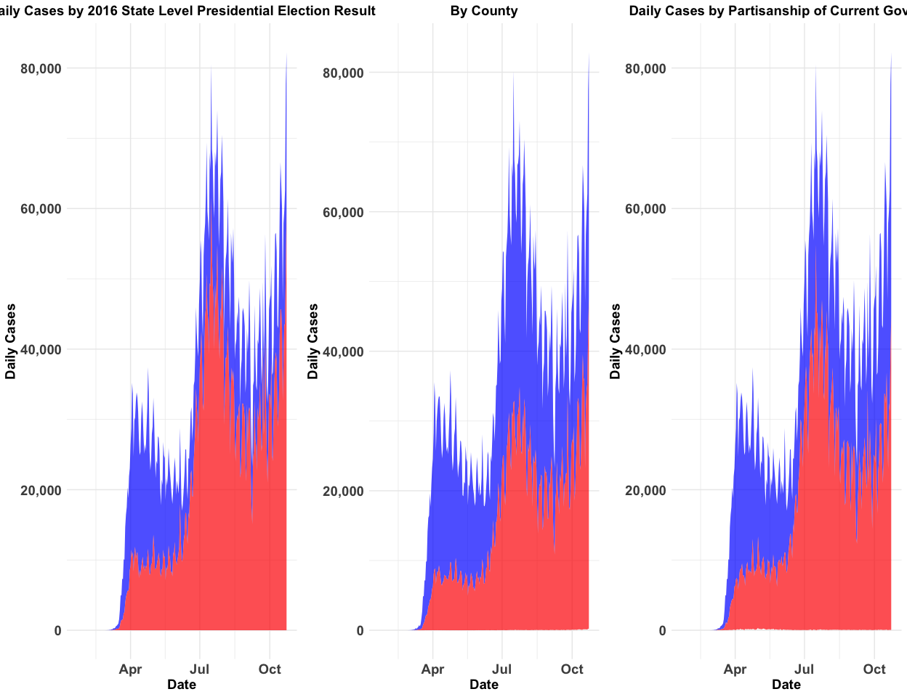

## Headline Numbers 
As of the latest CDC data release on July 20, 2020 there are:  

* 58,789 new cases
  + The state with the most cases is CA with 11,599
    - The county with the most cases is Los Angeles County in CA with 3,158 new cases 
  + The record number of national cases per day is 80,514 on July 16, 2020
* 453 new deaths
  +  The record number of deaths per day is 3,153 on April 14, 2020
  
Where I live, in Somerville, MA, as of July 20, 2020 there are:  

* 0 new cases  
* 27 cases in the last two weeks  
  + Out of 1026 cases overall   
    - 34 Fatalities and
    - 979 Recoveries

Consequently, in the United States, there are now:   

* 3,804,518 total cases  
* 139,863 total deaths  

Globally, as of the latest WHO data release on July 21, 2020, there are: 

* 14,562,550 total cases
  + 213,637 today
* 607,781 total deaths
  + 4,083 today

## Overall Covid Cases In The USA

Regions are defined as follows: Northeast (CT, ME, MA, NH, RI, VT, NJ, NY, PA), Midwest (IN, IL, MI, OH, WI, IA, KS, MN, MO, NE, ND, SD), South (AL, AR, DC, DE, FL, GA, KY, LA, MD, MS, NC, OK, SC, TN, TX, VA, WV) and West (AZ, CO, ID,  NM, MT, UT, NV, WY, AK, CA, HI, OR, WA).

<!-- -->

## US Cases Compared to World Cases
<!-- -->

## Covid Cases in Somerville, MA and MA
<!-- -->

## Latest Cases in Boston Area (Today, One Week Ago, Two Weeks Ago)

<table class="table table-striped table-hover" style="margin-left: auto; margin-right: auto;">
 <thead>
  <tr>
   <th style="text-align:left;"> Date </th>
   <th style="text-align:left;"> County Name </th>
   <th style="text-align:right;"> Cases </th>
   <th style="text-align:right;"> Deaths </th>
   <th style="text-align:right;"> New Cases </th>
   <th style="text-align:right;"> New Deaths </th>
  </tr>
 </thead>
<tbody>
  <tr>
   <td style="text-align:left;"> July 20, 2020 </td>
   <td style="text-align:left;"> Middlesex County </td>
   <td style="text-align:right;"> 24958 </td>
   <td style="text-align:right;"> 1948 </td>
   <td style="text-align:right;"> 72 </td>
   <td style="text-align:right;"> 1 </td>
  </tr>
  <tr>
   <td style="text-align:left;"> July 13, 2020 </td>
   <td style="text-align:left;"> Middlesex County </td>
   <td style="text-align:right;"> 24536 </td>
   <td style="text-align:right;"> 1921 </td>
   <td style="text-align:right;"> 53 </td>
   <td style="text-align:right;"> 5 </td>
  </tr>
  <tr>
   <td style="text-align:left;"> July 06, 2020 </td>
   <td style="text-align:left;"> Middlesex County </td>
   <td style="text-align:right;"> 24193 </td>
   <td style="text-align:right;"> 1882 </td>
   <td style="text-align:right;"> 40 </td>
   <td style="text-align:right;"> 3 </td>
  </tr>
  <tr>
   <td style="text-align:left;"> July 20, 2020 </td>
   <td style="text-align:left;"> Norfolk County </td>
   <td style="text-align:right;"> 9737 </td>
   <td style="text-align:right;"> 968 </td>
   <td style="text-align:right;"> 38 </td>
   <td style="text-align:right;"> 1 </td>
  </tr>
  <tr>
   <td style="text-align:left;"> July 13, 2020 </td>
   <td style="text-align:left;"> Norfolk County </td>
   <td style="text-align:right;"> 9485 </td>
   <td style="text-align:right;"> 958 </td>
   <td style="text-align:right;"> 23 </td>
   <td style="text-align:right;"> 0 </td>
  </tr>
  <tr>
   <td style="text-align:left;"> July 06, 2020 </td>
   <td style="text-align:left;"> Norfolk County </td>
   <td style="text-align:right;"> 9284 </td>
   <td style="text-align:right;"> 940 </td>
   <td style="text-align:right;"> 11 </td>
   <td style="text-align:right;"> 0 </td>
  </tr>
  <tr>
   <td style="text-align:left;"> July 20, 2020 </td>
   <td style="text-align:left;"> Suffolk County </td>
   <td style="text-align:right;"> 20621 </td>
   <td style="text-align:right;"> 1035 </td>
   <td style="text-align:right;"> 20 </td>
   <td style="text-align:right;"> 0 </td>
  </tr>
  <tr>
   <td style="text-align:left;"> July 13, 2020 </td>
   <td style="text-align:left;"> Suffolk County </td>
   <td style="text-align:right;"> 20342 </td>
   <td style="text-align:right;"> 1020 </td>
   <td style="text-align:right;"> 41 </td>
   <td style="text-align:right;"> 0 </td>
  </tr>
  <tr>
   <td style="text-align:left;"> July 06, 2020 </td>
   <td style="text-align:left;"> Suffolk County </td>
   <td style="text-align:right;"> 20014 </td>
   <td style="text-align:right;"> 1008 </td>
   <td style="text-align:right;"> 29 </td>
   <td style="text-align:right;"> 1 </td>
  </tr>
</tbody>
</table>

## New Covid Cases By State

The plot below shows the number of new COVID cases by state.  Note that each figure has its own y axis; this is done so that trends can be seen within each state.  Log scales can make the difference between 100 and 1000 cases hard to discern and a common y axis causes states like NY and CA to swamp states like NC.  Negative new cases can occur when States revise their total number of cases downwards, as Hawaii did between June 30, 2020 and July 1, 2020.

<!-- -->

## COVID Cases per 1,000 Residents by State

This figure shows the number of COVID cases per 1,000.

<!-- -->

## Latest County Case Map
<!-- -->

## Latest County Death Map
<!-- -->

## Counties with the Most Cases Over Time
<table class="table table-striped table-hover" style="margin-left: auto; margin-right: auto;">
 <thead>
  <tr>
   <th style="text-align:left;"> Date </th>
   <th style="text-align:left;"> State </th>
   <th style="text-align:left;"> County Name </th>
   <th style="text-align:right;"> Cases </th>
   <th style="text-align:right;"> Deaths </th>
  </tr>
 </thead>
<tbody>
  <tr>
   <td style="text-align:left;"> 2020-07-20 </td>
   <td style="text-align:left;"> CA </td>
   <td style="text-align:left;"> Los Angeles County </td>
   <td style="text-align:right;"> 159045 </td>
   <td style="text-align:right;"> 4104 </td>
  </tr>
  <tr>
   <td style="text-align:left;"> 2020-07-20 </td>
   <td style="text-align:left;"> IL </td>
   <td style="text-align:left;"> Cook County </td>
   <td style="text-align:right;"> 99052 </td>
   <td style="text-align:right;"> 4777 </td>
  </tr>
  <tr>
   <td style="text-align:left;"> 2020-07-20 </td>
   <td style="text-align:left;"> AZ </td>
   <td style="text-align:left;"> Maricopa County </td>
   <td style="text-align:right;"> 96711 </td>
   <td style="text-align:right;"> 1485 </td>
  </tr>
  <tr>
   <td style="text-align:left;"> 2020-07-20 </td>
   <td style="text-align:left;"> FL </td>
   <td style="text-align:left;"> Miami-Dade County </td>
   <td style="text-align:right;"> 87035 </td>
   <td style="text-align:right;"> 1309 </td>
  </tr>
  <tr>
   <td style="text-align:left;"> 2020-07-20 </td>
   <td style="text-align:left;"> NY </td>
   <td style="text-align:left;"> Queens County </td>
   <td style="text-align:right;"> 67079 </td>
   <td style="text-align:right;"> 7137 </td>
  </tr>
  <tr>
   <td style="text-align:left;"> 2020-07-01 </td>
   <td style="text-align:left;"> CA </td>
   <td style="text-align:left;"> Los Angeles County </td>
   <td style="text-align:right;"> 105507 </td>
   <td style="text-align:right;"> 3402 </td>
  </tr>
  <tr>
   <td style="text-align:left;"> 2020-07-01 </td>
   <td style="text-align:left;"> IL </td>
   <td style="text-align:left;"> Cook County </td>
   <td style="text-align:right;"> 90911 </td>
   <td style="text-align:right;"> 4581 </td>
  </tr>
  <tr>
   <td style="text-align:left;"> 2020-07-01 </td>
   <td style="text-align:left;"> NY </td>
   <td style="text-align:left;"> Queens County </td>
   <td style="text-align:right;"> 65455 </td>
   <td style="text-align:right;"> 7059 </td>
  </tr>
  <tr>
   <td style="text-align:left;"> 2020-07-01 </td>
   <td style="text-align:left;"> NY </td>
   <td style="text-align:left;"> Kings County </td>
   <td style="text-align:right;"> 59742 </td>
   <td style="text-align:right;"> 7104 </td>
  </tr>
  <tr>
   <td style="text-align:left;"> 2020-07-01 </td>
   <td style="text-align:left;"> AZ </td>
   <td style="text-align:left;"> Maricopa County </td>
   <td style="text-align:right;"> 52266 </td>
   <td style="text-align:right;"> 817 </td>
  </tr>
  <tr>
   <td style="text-align:left;"> 2020-06-01 </td>
   <td style="text-align:left;"> IL </td>
   <td style="text-align:left;"> Cook County </td>
   <td style="text-align:right;"> 78495 </td>
   <td style="text-align:right;"> 3658 </td>
  </tr>
  <tr>
   <td style="text-align:left;"> 2020-06-01 </td>
   <td style="text-align:left;"> NY </td>
   <td style="text-align:left;"> Queens County </td>
   <td style="text-align:right;"> 62094 </td>
   <td style="text-align:right;"> 6271 </td>
  </tr>
  <tr>
   <td style="text-align:left;"> 2020-06-01 </td>
   <td style="text-align:left;"> NY </td>
   <td style="text-align:left;"> Kings County </td>
   <td style="text-align:right;"> 56053 </td>
   <td style="text-align:right;"> 6742 </td>
  </tr>
  <tr>
   <td style="text-align:left;"> 2020-06-01 </td>
   <td style="text-align:left;"> CA </td>
   <td style="text-align:left;"> Los Angeles County </td>
   <td style="text-align:right;"> 55968 </td>
   <td style="text-align:right;"> 2362 </td>
  </tr>
  <tr>
   <td style="text-align:left;"> 2020-06-01 </td>
   <td style="text-align:left;"> NY </td>
   <td style="text-align:left;"> Bronx County </td>
   <td style="text-align:right;"> 45359 </td>
   <td style="text-align:right;"> 4480 </td>
  </tr>
  <tr>
   <td style="text-align:left;"> 2020-05-01 </td>
   <td style="text-align:left;"> NY </td>
   <td style="text-align:left;"> Queens County </td>
   <td style="text-align:right;"> 52274 </td>
   <td style="text-align:right;"> 5111 </td>
  </tr>
  <tr>
   <td style="text-align:left;"> 2020-05-01 </td>
   <td style="text-align:left;"> NY </td>
   <td style="text-align:left;"> Kings County </td>
   <td style="text-align:right;"> 45519 </td>
   <td style="text-align:right;"> 5320 </td>
  </tr>
  <tr>
   <td style="text-align:left;"> 2020-05-01 </td>
   <td style="text-align:left;"> IL </td>
   <td style="text-align:left;"> Cook County </td>
   <td style="text-align:right;"> 38668 </td>
   <td style="text-align:right;"> 1673 </td>
  </tr>
  <tr>
   <td style="text-align:left;"> 2020-05-01 </td>
   <td style="text-align:left;"> NY </td>
   <td style="text-align:left;"> Bronx County </td>
   <td style="text-align:right;"> 37785 </td>
   <td style="text-align:right;"> 3527 </td>
  </tr>
  <tr>
   <td style="text-align:left;"> 2020-05-01 </td>
   <td style="text-align:left;"> NY </td>
   <td style="text-align:left;"> Nassau County </td>
   <td style="text-align:right;"> 36161 </td>
   <td style="text-align:right;"> 1720 </td>
  </tr>
</tbody>
</table>

## Hospitalizations By State

<!-- -->

## Patients Currently in the ICU

<!-- -->

## Patients Currently on Ventilators 

<!-- -->

## Cumulative Cases by County in the Northeast
<!-- -->

## Cumulative Cases by State Over Time

<!-- -->

## Cumulative Deaths by State Over Time

<!-- -->

## Daily Percent Positive Cases 

According to the WHO the positive rate should be below 5%.^[https://coronavirus.jhu.edu/testing/tracker/overview]  Days above the threshold are denoted in red, days below are in blue.  Note that the variables currently used for these plots --positiveIncrease and negativeIncrease-- are being phased out and will be replaced by positiveCasesViral and negativeCasesViral.

<!-- -->

## Partisanship and COVID Cases

<!-- -->

# Variants of Select Figures

## Week to Week Changes in COVID Cases

<!-- -->

## Confirmed Cases as a Percentage of State Population

The two sets of points are confirmed cases (black), and potential cases (grey) which are confirmed cases times ten.  For herd immunity, typically 70-90% of a population needs immunity.^[See <https://www.jhsph.edu/covid-19/articles/achieving-herd-immunity-with-covid19.html>]

<!-- -->

## Data Sources

Data for this report comes from:

* The CDC Homepage <https://www.cdc.gov/covid-data-tracker/index.html#county-map> and <https://usafacts.org/visualizations/coronavirus-covid-19-spread-map/>, specifically:
    + Confirmed COVID Cases <https://usafactsstatic.blob.core.windows.net/public/data/covid-19/covid_confirmed_usafacts.csv>
    + Covid Deaths <https://usafactsstatic.blob.core.windows.net/public/data/covid-19/covid_deaths_usafacts.csv>
    + County Population <https://usafactsstatic.blob.core.windows.net/public/data/covid-19/covid_county_population_usafacts.csv>
* Covidtracker.com data (used by Johns Hopkins <https://coronavirus.jhu.edu/us-map>) <https://covidtracking.com/api/v1/states/daily.csv>
* World Health Organization <https://covid19.who.int/>
* Somerville City data <https://somerville-dashboardcovid.trial.opendatasoft.com/pages/citysdashboard/>

## Different Counts from Different Data

See the difference between <https://covidtracking.com/api/v1/states/daily.csv> and <https://usafacts.org/visualizations/coronavirus-covid-19-spread-map/>

<!-- -->

