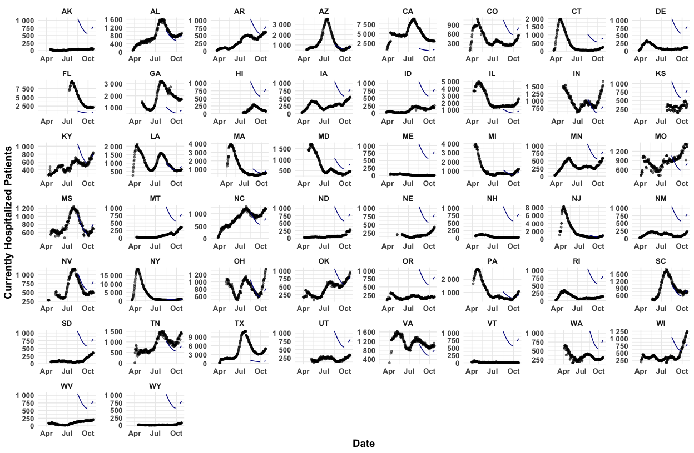
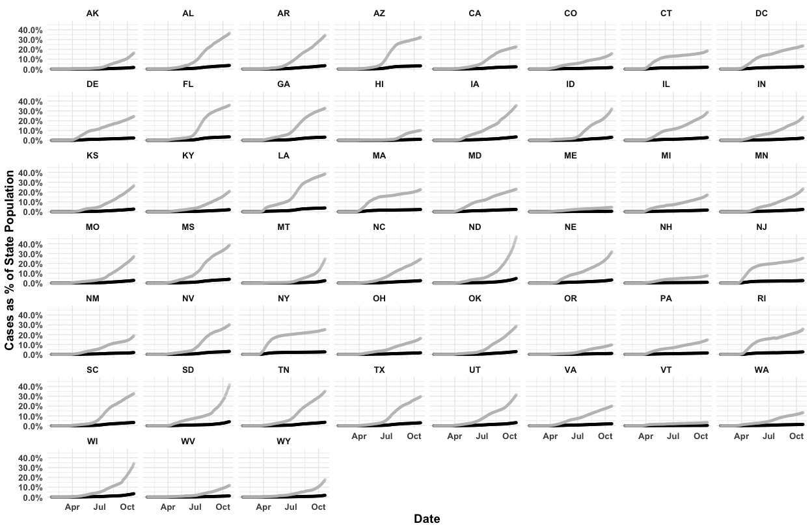

## Headline Numbers 
As of the latest CDC data release on July 02, 2020:  

* 56,494 new cases.
  + The record number of cases per day is 56,494 on July 02, 2020
* 809 new deaths
  +  The record number of deaths per day is 3,153 on April 14, 2020

Consequently, in the United States, there are now:   

* 2,724,650 total cases  
* 128,102 total deaths  

Globally, as of the latest WHO data release on July 03, 2020, there are: 

* 7,972,136 total cases
  + 186,167 today
* 318,932 total deaths
  + 4,495 today

## Overall Covid Cases In The USA

Regions are defined as follows: Northeast (CT, ME, MA, NH, RI, VT, NJ, NY, PA), Midwest (IN, IL, MI, OH, WI, IA, KS, MN, MO, NE, ND, SD), South (AL, AR, DC, DE, FL, GA, KY, LA, MD, MS, NC, OK, SC, TN, TX, VA, WV) and West (AZ, CO, ID,  NM, MT, UT, NV, WY,AK,CA,HI,OR,WA).

<!-- -->

## US Cases Compared to World Cases
<!-- -->

## Covid Cases in Somerville, MA in the Last Two Weeks
<!-- -->

## Covid Cases in MA in the Last Two Weeks 
<!-- -->

## Latest Cases in Boston Area (Today, One Week Ago, Two Weeks Ago)

Date            County Name         Cases   Deaths   New Cases   New Deaths
--------------  -----------------  ------  -------  ----------  -----------
July 02, 2020   Middlesex County    24039     1867          41            9
June 25, 2020   Middlesex County    23741     1825          44            5
June 18, 2020   Middlesex County    23407     1788          61            7
July 02, 2020   Norfolk County       9200      933          16            3
June 25, 2020   Norfolk County       9082      923          26            0
June 18, 2020   Norfolk County       8935      905          27            2
July 02, 2020   Suffolk County      19892     1008          39            4
June 25, 2020   Suffolk County      19664      990          36            6
June 18, 2020   Suffolk County      19477      963          43            4

## New Covid Cases By State: Log Scale Cases

<!-- -->

## Latest County Case Map
<!-- -->

## Latest County Death Map
<!-- -->

## Top 5 Counties: Today and The First of Each Month

Date         State   County Name            Cases   Deaths
-----------  ------  -------------------  -------  -------
2020-07-02   CA      Los Angeles County    107667     3454
2020-07-02   IL      Cook County            91381     4609
2020-07-02   NY      Queens County          65568     7063
2020-07-02   NY      Kings County           59855     7111
2020-07-02   AZ      Maricopa County        54757      843
2020-07-01   CA      Los Angeles County    105507     3402
2020-07-01   IL      Cook County            90911     4581
2020-07-01   NY      Queens County          65455     7059
2020-07-01   NY      Kings County           59742     7104
2020-07-01   AZ      Maricopa County        52266      817
2020-06-01   IL      Cook County            78495     3658
2020-06-01   NY      Queens County          62094     6271
2020-06-01   NY      Kings County           56053     6742
2020-06-01   CA      Los Angeles County     55968     2362
2020-06-01   NY      Bronx County           45359     4480
2020-05-01   NY      Queens County          52274     5111
2020-05-01   NY      Kings County           45519     5320
2020-05-01   IL      Cook County            38668     1673
2020-05-01   NY      Bronx County           37785     3527
2020-05-01   NY      Nassau County          36161     1720
2020-04-01   NY      Queens County          15217      447
2020-04-01   NY      Kings County           12274      328
2020-04-01   NY      Westchester County     10683       64
2020-04-01   NY      Nassau County           9554       76
2020-04-01   NY      Bronx County            8607      360
2020-03-01   CA      Santa Clara County        13        2
2020-03-01   WA      King County                9        1
2020-03-01   IL      Cook County                3        0
2020-03-01   WA      Snohomish County           2        0
2020-03-01   CA      Sacramento County          2        0
2020-02-01   IL      Cook County                2        0
2020-02-01   CA      Santa Clara County         2        0
2020-02-01   MA      Suffolk County             1        0
2020-02-01   AZ      Maricopa County            1        0
2020-02-01   WA      King County                1        0

## Total Covid Cases By State: Free Scale Cases
<!-- -->

## Hospitalizations By State

<!-- -->

## Week to Week Changes in COVID Cases

<!-- -->

## Cases as a Percentage of State Population
<!-- -->

## Northeast Cases By Month
<!-- -->

## Cases By State Over Time

<!-- -->

## Deaths By State Over Time

<!-- -->

## Positive Tests Over Negative Tests in the Last Two Weeks

<!-- -->

## Currently Hospitalized Patients

<!-- -->

## Patients Currently on Ventilators 

<!-- -->

## Data Sources

Data for this report comes from:

* The CDC Homepage <https://www.cdc.gov/covid-data-tracker/index.html#county-map> and <https://usafacts.org/visualizations/coronavirus-covid-19-spread-map/>, specifically:
    + Confirmed COVID Cases <https://usafactsstatic.blob.core.windows.net/public/data/covid-19/covid_confirmed_usafacts.csv>
    + Covid Deaths <https://usafactsstatic.blob.core.windows.net/public/data/covid-19/covid_deaths_usafacts.csv>
    + County Population <https://usafactsstatic.blob.core.windows.net/public/data/covid-19/covid_county_population_usafacts.csv>
* Covidtracker.com data (used by Johns Hopkins <https://coronavirus.jhu.edu/us-map>) <https://covidtracking.com/api/v1/states/daily.csv>
* World Health Organization <https://covid19.who.int/>
* Somerville City data <https://somerville-dashboardcovid.trial.opendatasoft.com/pages/citysdashboard/>

## Different Counts from Different Data

See the difference between <https://covidtracking.com/api/v1/states/daily.csv> and <https://usafacts.org/visualizations/coronavirus-covid-19-spread-map/>

<!-- -->

