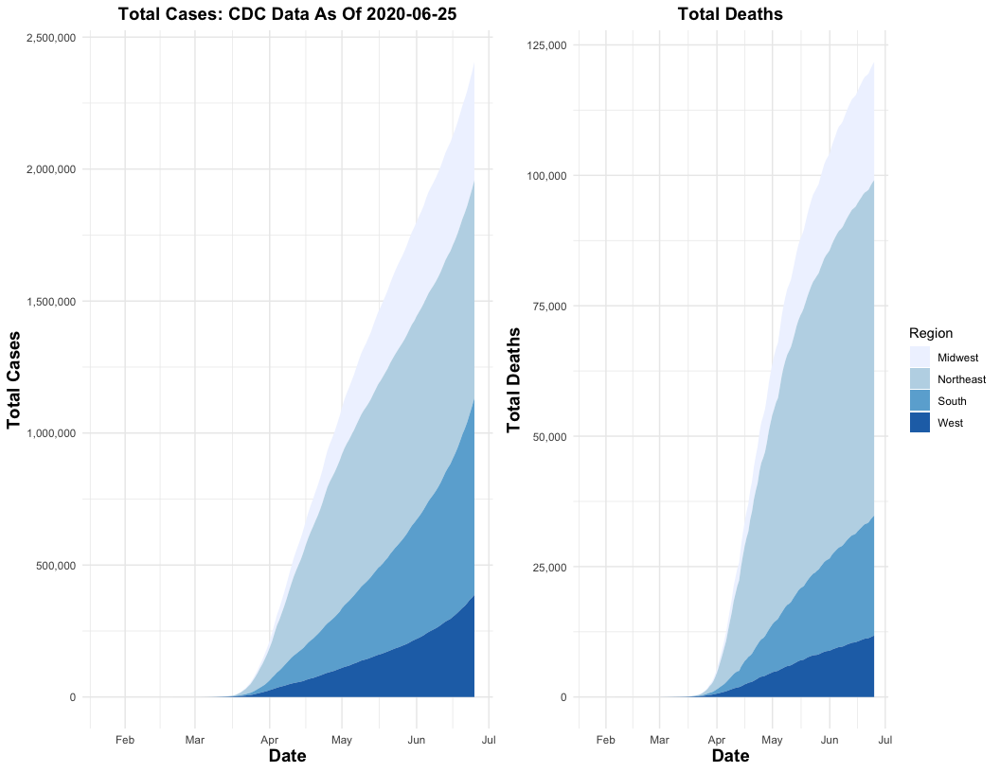

Covid Figures and Maps
================
Steven Rashin
June 26, 2020

## Data Sources

Data for this report comes from:

  - The CDC Homepage
    <https://www.cdc.gov/covid-data-tracker/index.html#county-map> and
    <https://usafacts.org/visualizations/coronavirus-covid-19-spread-map/>,
    specifically:
      - Confirmed COVID Cases
        <https://usafactsstatic.blob.core.windows.net/public/data/covid-19/covid_confirmed_usafacts.csv>
      - Covid Deaths
        <https://usafactsstatic.blob.core.windows.net/public/data/covid-19/covid_deaths_usafacts.csv>
      - County Population
        <https://usafactsstatic.blob.core.windows.net/public/data/covid-19/covid_county_population_usafacts.csv>
  - Covidtracker.com data (used by Johns Hopkins
    <https://coronavirus.jhu.edu/us-map>)
    <https://covidtracking.com/api/v1/states/daily.csv>
  - Somerville City data
    <https://somerville-dashboardcovid.trial.opendatasoft.com/pages/citysdashboard/>

## Overall Covid Cases In The USA

<!-- -->

## Covid Cases in Somerville, MA in the Last Two Weeks

<!-- -->

## Covid Cases in MA in the Last Two Weeks

<!-- -->

## Latest Cases in Boston Area

| Date       | County Name      | Cases | Deaths | New Cases | New Deaths |
| :--------- | :--------------- | ----: | -----: | --------: | ---------: |
| 2020-06-25 | Middlesex County | 23741 |   1825 |        44 |          5 |
| 2020-06-24 | Middlesex County | 23697 |   1820 |        50 |          8 |
| 2020-06-23 | Middlesex County | 23647 |   1812 |        38 |          3 |
| 2020-06-22 | Middlesex County | 23609 |   1809 |        35 |          2 |
| 2020-06-21 | Middlesex County | 23574 |   1807 |        30 |          6 |
| 2020-06-20 | Middlesex County | 23544 |   1801 |        80 |         10 |
| 2020-06-19 | Middlesex County | 23464 |   1791 |        57 |          3 |
| 2020-06-18 | Middlesex County | 23407 |   1788 |        61 |          7 |
| 2020-06-25 | Norfolk County   |  9082 |    924 |        26 |          1 |
| 2020-06-24 | Norfolk County   |  9056 |    923 |        14 |          4 |
| 2020-06-23 | Norfolk County   |  9042 |    919 |        32 |          5 |
| 2020-06-22 | Norfolk County   |  9010 |    914 |        16 |          2 |
| 2020-06-21 | Norfolk County   |  8994 |    912 |        11 |          4 |
| 2020-06-20 | Norfolk County   |  8983 |    908 |        21 |          1 |
| 2020-06-19 | Norfolk County   |  8962 |    907 |        27 |          2 |
| 2020-06-18 | Norfolk County   |  8935 |    905 |        27 |          2 |
| 2020-06-25 | Suffolk County   | 19664 |    990 |        36 |          6 |
| 2020-06-24 | Suffolk County   | 19628 |    984 |        27 |          8 |
| 2020-06-23 | Suffolk County   | 19601 |    976 |        34 |          0 |
| 2020-06-22 | Suffolk County   | 19567 |    976 |        16 |          0 |
| 2020-06-21 | Suffolk County   | 19551 |    976 |        23 |          3 |
| 2020-06-20 | Suffolk County   | 19528 |    973 |        35 |          2 |
| 2020-06-19 | Suffolk County   | 19493 |    971 |        16 |          8 |
| 2020-06-18 | Suffolk County   | 19477 |    963 |        43 |          4 |

## New Covid Cases By State: Log Scale Cases

<!-- -->

## Latest County Case Map

<!-- -->

## Latest County Death Map

<!-- -->

## Top 5 Counties: Today and The First of Each Month

| Date       | State | County Name        | Cases | Deaths |
| :--------- | :---- | :----------------- | ----: | -----: |
| 2020-06-25 | CA    | Los Angeles County | 91467 |   3246 |
| 2020-06-25 | IL    | Cook County        | 88650 |   4500 |
| 2020-06-25 | NY    | Queens County      | 64987 |   6580 |
| 2020-06-25 | NY    | Kings County       | 59206 |   7001 |
| 2020-06-25 | NY    | Bronx County       | 47294 |   4662 |
| 2020-06-01 | IL    | Cook County        | 78495 |   3658 |
| 2020-06-01 | NY    | Queens County      | 62094 |   6271 |
| 2020-06-01 | NY    | Kings County       | 56053 |   6742 |
| 2020-06-01 | CA    | Los Angeles County | 55968 |   2362 |
| 2020-06-01 | NY    | Bronx County       | 45359 |   4480 |
| 2020-05-01 | NY    | Queens County      | 52274 |   5111 |
| 2020-05-01 | NY    | Kings County       | 45519 |   5320 |
| 2020-05-01 | IL    | Cook County        | 38668 |   1673 |
| 2020-05-01 | NY    | Bronx County       | 37785 |   3527 |
| 2020-05-01 | NY    | Nassau County      | 36161 |   1720 |
| 2020-04-01 | NY    | Queens County      | 15217 |    447 |
| 2020-04-01 | NY    | Kings County       | 12274 |    328 |
| 2020-04-01 | NY    | Westchester County | 10683 |     64 |
| 2020-04-01 | NY    | Nassau County      |  9554 |     76 |
| 2020-04-01 | NY    | Bronx County       |  8607 |    360 |
| 2020-03-01 | CA    | Santa Clara County |    13 |      2 |
| 2020-03-01 | WA    | King County        |     9 |      1 |
| 2020-03-01 | IL    | Cook County        |     3 |      0 |
| 2020-03-01 | WA    | Snohomish County   |     2 |      0 |
| 2020-03-01 | CA    | Sacramento County  |     2 |      0 |
| 2020-02-01 | IL    | Cook County        |     2 |      0 |
| 2020-02-01 | CA    | Santa Clara County |     2 |      0 |
| 2020-02-01 | MA    | Suffolk County     |     1 |      0 |
| 2020-02-01 | AZ    | Maricopa County    |     1 |      0 |
| 2020-02-01 | WA    | King County        |     1 |      0 |

## Total Covid Cases By State: Free Scale Cases

<!-- -->

## Hospitalizations By State

<!-- -->

## Week to Week Changes in COVID Cases

<!-- -->

## Cases as a Percentage of State Population

<!-- -->

## Northeast Cases By Month

<!-- -->

## Cases By State Over Time

<!-- -->

## Deaths By State Over Time

<!-- -->

## Positive Tests Over Negative Tests in the Last Two Weeks

<!-- -->

## Currently Hospitalized Patients

<!-- -->

## Patients Currently on Ventilators

<!-- -->

## Different Counts from Different Data

See the difference between
<https://covidtracking.com/api/v1/states/daily.csv> and
<https://usafacts.org/visualizations/coronavirus-covid-19-spread-map/>

<!-- -->
