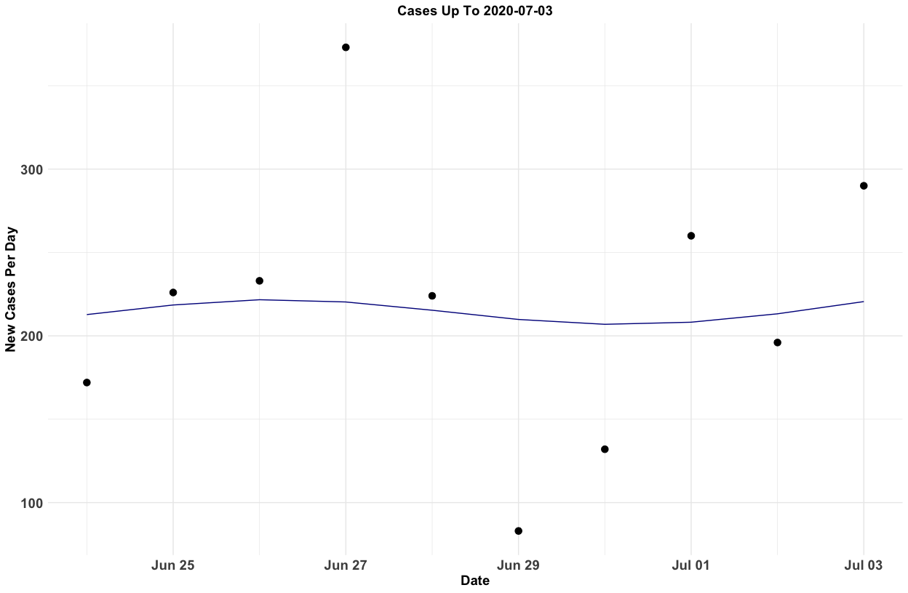
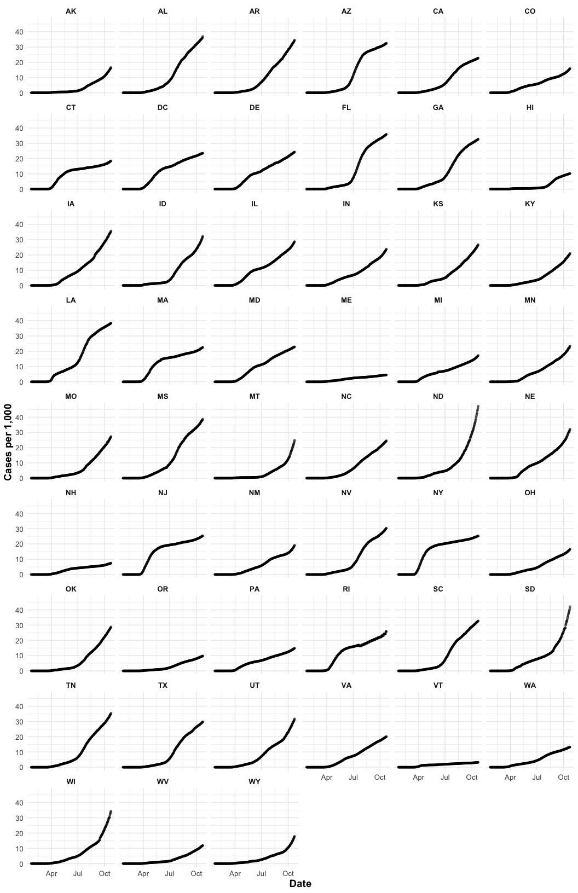
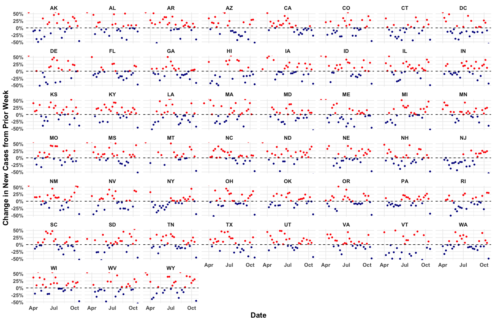
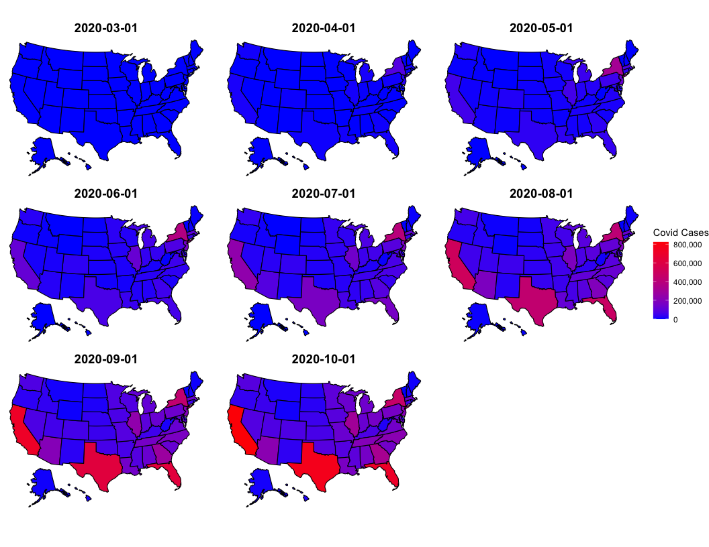
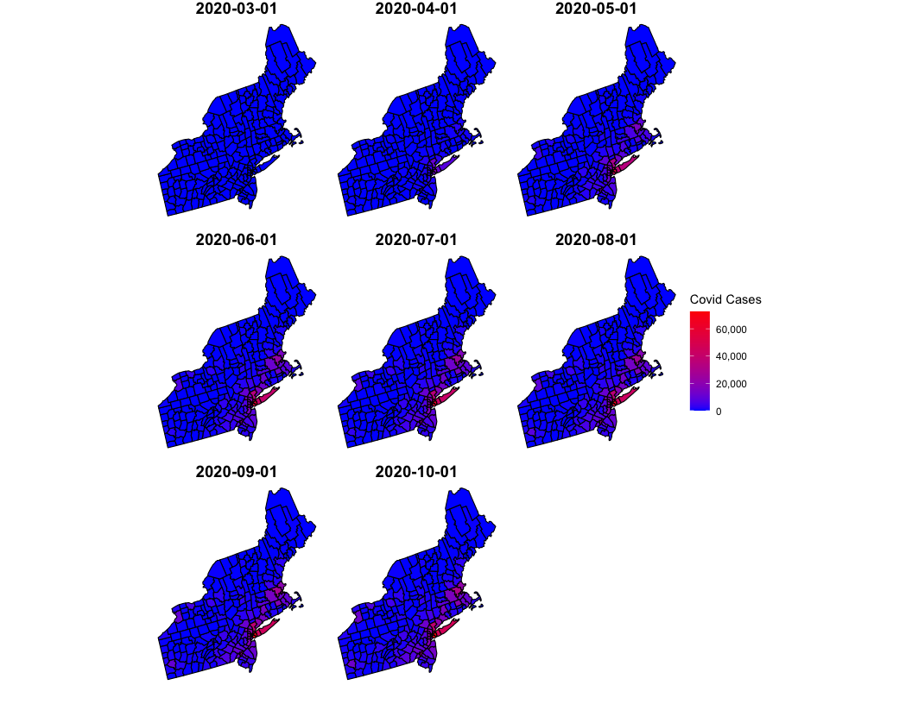
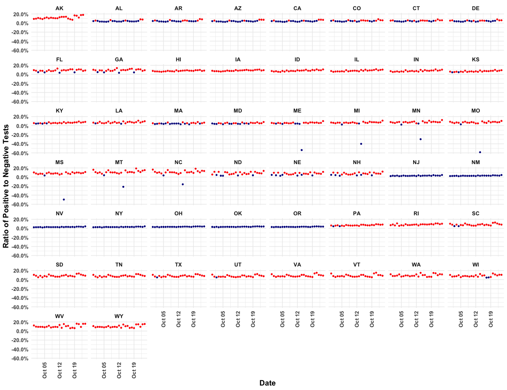

## Headline Numbers 
As of the latest CDC data release on July 02, 2020:  

* 56,494 new cases.
  + The record number of cases per day is 56,494 on July 02, 2020
* 809 new deaths
  +  The record number of deaths per day is 3,153 on April 14, 2020

Consequently, in the United States, there are now:   

* 2,724,650 total cases  
* 128,102 total deaths  

Globally, as of the latest WHO data release on July 03, 2020, there are: 

* 7,972,136 total cases
  + 186,167 today
* 318,932 total deaths
  + 4,495 today

## Overall Covid Cases In The USA

Regions are defined as follows: Northeast (CT, ME, MA, NH, RI, VT, NJ, NY, PA), Midwest (IN, IL, MI, OH, WI, IA, KS, MN, MO, NE, ND, SD), South (AL, AR, DC, DE, FL, GA, KY, LA, MD, MS, NC, OK, SC, TN, TX, VA, WV) and West (AZ, CO, ID,  NM, MT, UT, NV, WY,AK,CA,HI,OR,WA).

<!-- -->

## US Cases Compared to World Cases
<!-- -->

## Covid Cases in Somerville, MA in the Last Two Weeks
<!-- -->

## Covid Cases in MA in the Last Two Weeks 
<!-- -->

## Latest Cases in Boston Area (Today, One Week Ago, Two Weeks Ago)

<table class="table table-striped table-hover" style="margin-left: auto; margin-right: auto;">
 <thead>
  <tr>
   <th style="text-align:left;"> Date </th>
   <th style="text-align:left;"> County Name </th>
   <th style="text-align:right;"> Cases </th>
   <th style="text-align:right;"> Deaths </th>
   <th style="text-align:right;"> New Cases </th>
   <th style="text-align:right;"> New Deaths </th>
  </tr>
 </thead>
<tbody>
  <tr>
   <td style="text-align:left;"> July 02, 2020 </td>
   <td style="text-align:left;"> Middlesex County </td>
   <td style="text-align:right;"> 24039 </td>
   <td style="text-align:right;"> 1867 </td>
   <td style="text-align:right;"> 41 </td>
   <td style="text-align:right;"> 9 </td>
  </tr>
  <tr>
   <td style="text-align:left;"> June 25, 2020 </td>
   <td style="text-align:left;"> Middlesex County </td>
   <td style="text-align:right;"> 23741 </td>
   <td style="text-align:right;"> 1825 </td>
   <td style="text-align:right;"> 44 </td>
   <td style="text-align:right;"> 5 </td>
  </tr>
  <tr>
   <td style="text-align:left;"> June 18, 2020 </td>
   <td style="text-align:left;"> Middlesex County </td>
   <td style="text-align:right;"> 23407 </td>
   <td style="text-align:right;"> 1788 </td>
   <td style="text-align:right;"> 61 </td>
   <td style="text-align:right;"> 7 </td>
  </tr>
  <tr>
   <td style="text-align:left;"> July 02, 2020 </td>
   <td style="text-align:left;"> Norfolk County </td>
   <td style="text-align:right;"> 9200 </td>
   <td style="text-align:right;"> 933 </td>
   <td style="text-align:right;"> 16 </td>
   <td style="text-align:right;"> 3 </td>
  </tr>
  <tr>
   <td style="text-align:left;"> June 25, 2020 </td>
   <td style="text-align:left;"> Norfolk County </td>
   <td style="text-align:right;"> 9082 </td>
   <td style="text-align:right;"> 923 </td>
   <td style="text-align:right;"> 26 </td>
   <td style="text-align:right;"> 0 </td>
  </tr>
  <tr>
   <td style="text-align:left;"> June 18, 2020 </td>
   <td style="text-align:left;"> Norfolk County </td>
   <td style="text-align:right;"> 8935 </td>
   <td style="text-align:right;"> 905 </td>
   <td style="text-align:right;"> 27 </td>
   <td style="text-align:right;"> 2 </td>
  </tr>
  <tr>
   <td style="text-align:left;"> July 02, 2020 </td>
   <td style="text-align:left;"> Suffolk County </td>
   <td style="text-align:right;"> 19892 </td>
   <td style="text-align:right;"> 1008 </td>
   <td style="text-align:right;"> 39 </td>
   <td style="text-align:right;"> 4 </td>
  </tr>
  <tr>
   <td style="text-align:left;"> June 25, 2020 </td>
   <td style="text-align:left;"> Suffolk County </td>
   <td style="text-align:right;"> 19664 </td>
   <td style="text-align:right;"> 990 </td>
   <td style="text-align:right;"> 36 </td>
   <td style="text-align:right;"> 6 </td>
  </tr>
  <tr>
   <td style="text-align:left;"> June 18, 2020 </td>
   <td style="text-align:left;"> Suffolk County </td>
   <td style="text-align:right;"> 19477 </td>
   <td style="text-align:right;"> 963 </td>
   <td style="text-align:right;"> 43 </td>
   <td style="text-align:right;"> 4 </td>
  </tr>
</tbody>
</table>

## New Covid Cases By State: Log Scale Cases

<!-- -->

## Latest County Case Map
<!-- -->

## Latest County Death Map
<!-- -->

## Top 5 Counties: Today and The First of Each Month
<table class="table table-striped table-hover" style="margin-left: auto; margin-right: auto;">
 <thead>
  <tr>
   <th style="text-align:left;"> Date </th>
   <th style="text-align:left;"> State </th>
   <th style="text-align:left;"> County Name </th>
   <th style="text-align:right;"> Cases </th>
   <th style="text-align:right;"> Deaths </th>
  </tr>
 </thead>
<tbody>
  <tr>
   <td style="text-align:left;"> 2020-07-02 </td>
   <td style="text-align:left;"> CA </td>
   <td style="text-align:left;"> Los Angeles County </td>
   <td style="text-align:right;"> 107667 </td>
   <td style="text-align:right;"> 3454 </td>
  </tr>
  <tr>
   <td style="text-align:left;"> 2020-07-02 </td>
   <td style="text-align:left;"> IL </td>
   <td style="text-align:left;"> Cook County </td>
   <td style="text-align:right;"> 91381 </td>
   <td style="text-align:right;"> 4609 </td>
  </tr>
  <tr>
   <td style="text-align:left;"> 2020-07-02 </td>
   <td style="text-align:left;"> NY </td>
   <td style="text-align:left;"> Queens County </td>
   <td style="text-align:right;"> 65568 </td>
   <td style="text-align:right;"> 7063 </td>
  </tr>
  <tr>
   <td style="text-align:left;"> 2020-07-02 </td>
   <td style="text-align:left;"> NY </td>
   <td style="text-align:left;"> Kings County </td>
   <td style="text-align:right;"> 59855 </td>
   <td style="text-align:right;"> 7111 </td>
  </tr>
  <tr>
   <td style="text-align:left;"> 2020-07-02 </td>
   <td style="text-align:left;"> AZ </td>
   <td style="text-align:left;"> Maricopa County </td>
   <td style="text-align:right;"> 54757 </td>
   <td style="text-align:right;"> 843 </td>
  </tr>
  <tr>
   <td style="text-align:left;"> 2020-07-01 </td>
   <td style="text-align:left;"> CA </td>
   <td style="text-align:left;"> Los Angeles County </td>
   <td style="text-align:right;"> 105507 </td>
   <td style="text-align:right;"> 3402 </td>
  </tr>
  <tr>
   <td style="text-align:left;"> 2020-07-01 </td>
   <td style="text-align:left;"> IL </td>
   <td style="text-align:left;"> Cook County </td>
   <td style="text-align:right;"> 90911 </td>
   <td style="text-align:right;"> 4581 </td>
  </tr>
  <tr>
   <td style="text-align:left;"> 2020-07-01 </td>
   <td style="text-align:left;"> NY </td>
   <td style="text-align:left;"> Queens County </td>
   <td style="text-align:right;"> 65455 </td>
   <td style="text-align:right;"> 7059 </td>
  </tr>
  <tr>
   <td style="text-align:left;"> 2020-07-01 </td>
   <td style="text-align:left;"> NY </td>
   <td style="text-align:left;"> Kings County </td>
   <td style="text-align:right;"> 59742 </td>
   <td style="text-align:right;"> 7104 </td>
  </tr>
  <tr>
   <td style="text-align:left;"> 2020-07-01 </td>
   <td style="text-align:left;"> AZ </td>
   <td style="text-align:left;"> Maricopa County </td>
   <td style="text-align:right;"> 52266 </td>
   <td style="text-align:right;"> 817 </td>
  </tr>
  <tr>
   <td style="text-align:left;"> 2020-06-01 </td>
   <td style="text-align:left;"> IL </td>
   <td style="text-align:left;"> Cook County </td>
   <td style="text-align:right;"> 78495 </td>
   <td style="text-align:right;"> 3658 </td>
  </tr>
  <tr>
   <td style="text-align:left;"> 2020-06-01 </td>
   <td style="text-align:left;"> NY </td>
   <td style="text-align:left;"> Queens County </td>
   <td style="text-align:right;"> 62094 </td>
   <td style="text-align:right;"> 6271 </td>
  </tr>
  <tr>
   <td style="text-align:left;"> 2020-06-01 </td>
   <td style="text-align:left;"> NY </td>
   <td style="text-align:left;"> Kings County </td>
   <td style="text-align:right;"> 56053 </td>
   <td style="text-align:right;"> 6742 </td>
  </tr>
  <tr>
   <td style="text-align:left;"> 2020-06-01 </td>
   <td style="text-align:left;"> CA </td>
   <td style="text-align:left;"> Los Angeles County </td>
   <td style="text-align:right;"> 55968 </td>
   <td style="text-align:right;"> 2362 </td>
  </tr>
  <tr>
   <td style="text-align:left;"> 2020-06-01 </td>
   <td style="text-align:left;"> NY </td>
   <td style="text-align:left;"> Bronx County </td>
   <td style="text-align:right;"> 45359 </td>
   <td style="text-align:right;"> 4480 </td>
  </tr>
  <tr>
   <td style="text-align:left;"> 2020-05-01 </td>
   <td style="text-align:left;"> NY </td>
   <td style="text-align:left;"> Queens County </td>
   <td style="text-align:right;"> 52274 </td>
   <td style="text-align:right;"> 5111 </td>
  </tr>
  <tr>
   <td style="text-align:left;"> 2020-05-01 </td>
   <td style="text-align:left;"> NY </td>
   <td style="text-align:left;"> Kings County </td>
   <td style="text-align:right;"> 45519 </td>
   <td style="text-align:right;"> 5320 </td>
  </tr>
  <tr>
   <td style="text-align:left;"> 2020-05-01 </td>
   <td style="text-align:left;"> IL </td>
   <td style="text-align:left;"> Cook County </td>
   <td style="text-align:right;"> 38668 </td>
   <td style="text-align:right;"> 1673 </td>
  </tr>
  <tr>
   <td style="text-align:left;"> 2020-05-01 </td>
   <td style="text-align:left;"> NY </td>
   <td style="text-align:left;"> Bronx County </td>
   <td style="text-align:right;"> 37785 </td>
   <td style="text-align:right;"> 3527 </td>
  </tr>
  <tr>
   <td style="text-align:left;"> 2020-05-01 </td>
   <td style="text-align:left;"> NY </td>
   <td style="text-align:left;"> Nassau County </td>
   <td style="text-align:right;"> 36161 </td>
   <td style="text-align:right;"> 1720 </td>
  </tr>
  <tr>
   <td style="text-align:left;"> 2020-04-01 </td>
   <td style="text-align:left;"> NY </td>
   <td style="text-align:left;"> Queens County </td>
   <td style="text-align:right;"> 15217 </td>
   <td style="text-align:right;"> 447 </td>
  </tr>
  <tr>
   <td style="text-align:left;"> 2020-04-01 </td>
   <td style="text-align:left;"> NY </td>
   <td style="text-align:left;"> Kings County </td>
   <td style="text-align:right;"> 12274 </td>
   <td style="text-align:right;"> 328 </td>
  </tr>
  <tr>
   <td style="text-align:left;"> 2020-04-01 </td>
   <td style="text-align:left;"> NY </td>
   <td style="text-align:left;"> Westchester County </td>
   <td style="text-align:right;"> 10683 </td>
   <td style="text-align:right;"> 64 </td>
  </tr>
  <tr>
   <td style="text-align:left;"> 2020-04-01 </td>
   <td style="text-align:left;"> NY </td>
   <td style="text-align:left;"> Nassau County </td>
   <td style="text-align:right;"> 9554 </td>
   <td style="text-align:right;"> 76 </td>
  </tr>
  <tr>
   <td style="text-align:left;"> 2020-04-01 </td>
   <td style="text-align:left;"> NY </td>
   <td style="text-align:left;"> Bronx County </td>
   <td style="text-align:right;"> 8607 </td>
   <td style="text-align:right;"> 360 </td>
  </tr>
  <tr>
   <td style="text-align:left;"> 2020-03-01 </td>
   <td style="text-align:left;"> CA </td>
   <td style="text-align:left;"> Santa Clara County </td>
   <td style="text-align:right;"> 13 </td>
   <td style="text-align:right;"> 2 </td>
  </tr>
  <tr>
   <td style="text-align:left;"> 2020-03-01 </td>
   <td style="text-align:left;"> WA </td>
   <td style="text-align:left;"> King County </td>
   <td style="text-align:right;"> 9 </td>
   <td style="text-align:right;"> 1 </td>
  </tr>
  <tr>
   <td style="text-align:left;"> 2020-03-01 </td>
   <td style="text-align:left;"> IL </td>
   <td style="text-align:left;"> Cook County </td>
   <td style="text-align:right;"> 3 </td>
   <td style="text-align:right;"> 0 </td>
  </tr>
  <tr>
   <td style="text-align:left;"> 2020-03-01 </td>
   <td style="text-align:left;"> WA </td>
   <td style="text-align:left;"> Snohomish County </td>
   <td style="text-align:right;"> 2 </td>
   <td style="text-align:right;"> 0 </td>
  </tr>
  <tr>
   <td style="text-align:left;"> 2020-03-01 </td>
   <td style="text-align:left;"> CA </td>
   <td style="text-align:left;"> Sacramento County </td>
   <td style="text-align:right;"> 2 </td>
   <td style="text-align:right;"> 0 </td>
  </tr>
  <tr>
   <td style="text-align:left;"> 2020-02-01 </td>
   <td style="text-align:left;"> IL </td>
   <td style="text-align:left;"> Cook County </td>
   <td style="text-align:right;"> 2 </td>
   <td style="text-align:right;"> 0 </td>
  </tr>
  <tr>
   <td style="text-align:left;"> 2020-02-01 </td>
   <td style="text-align:left;"> CA </td>
   <td style="text-align:left;"> Santa Clara County </td>
   <td style="text-align:right;"> 2 </td>
   <td style="text-align:right;"> 0 </td>
  </tr>
  <tr>
   <td style="text-align:left;"> 2020-02-01 </td>
   <td style="text-align:left;"> MA </td>
   <td style="text-align:left;"> Suffolk County </td>
   <td style="text-align:right;"> 1 </td>
   <td style="text-align:right;"> 0 </td>
  </tr>
  <tr>
   <td style="text-align:left;"> 2020-02-01 </td>
   <td style="text-align:left;"> AZ </td>
   <td style="text-align:left;"> Maricopa County </td>
   <td style="text-align:right;"> 1 </td>
   <td style="text-align:right;"> 0 </td>
  </tr>
  <tr>
   <td style="text-align:left;"> 2020-02-01 </td>
   <td style="text-align:left;"> WA </td>
   <td style="text-align:left;"> King County </td>
   <td style="text-align:right;"> 1 </td>
   <td style="text-align:right;"> 0 </td>
  </tr>
</tbody>
</table>

## Total Covid Cases By State: Free Scale Cases
<!-- -->

## Hospitalizations By State

<!-- -->

## Week to Week Changes in COVID Cases

<!-- -->

## Cases as a Percentage of State Population
<!-- -->

## Northeast Cases By Month
<!-- -->

## Cases By State Over Time

<!-- -->

## Deaths By State Over Time

<!-- -->

## Positive Tests Over Negative Tests in the Last Two Weeks

<!-- -->

## Currently Hospitalized Patients

<!-- -->

## Patients Currently on Ventilators 

<!-- -->

## Data Sources

Data for this report comes from:

* The CDC Homepage <https://www.cdc.gov/covid-data-tracker/index.html#county-map> and <https://usafacts.org/visualizations/coronavirus-covid-19-spread-map/>, specifically:
    + Confirmed COVID Cases <https://usafactsstatic.blob.core.windows.net/public/data/covid-19/covid_confirmed_usafacts.csv>
    + Covid Deaths <https://usafactsstatic.blob.core.windows.net/public/data/covid-19/covid_deaths_usafacts.csv>
    + County Population <https://usafactsstatic.blob.core.windows.net/public/data/covid-19/covid_county_population_usafacts.csv>
* Covidtracker.com data (used by Johns Hopkins <https://coronavirus.jhu.edu/us-map>) <https://covidtracking.com/api/v1/states/daily.csv>
* World Health Organization <https://covid19.who.int/>
* Somerville City data <https://somerville-dashboardcovid.trial.opendatasoft.com/pages/citysdashboard/>

## Different Counts from Different Data

See the difference between <https://covidtracking.com/api/v1/states/daily.csv> and <https://usafacts.org/visualizations/coronavirus-covid-19-spread-map/>

<!-- -->

