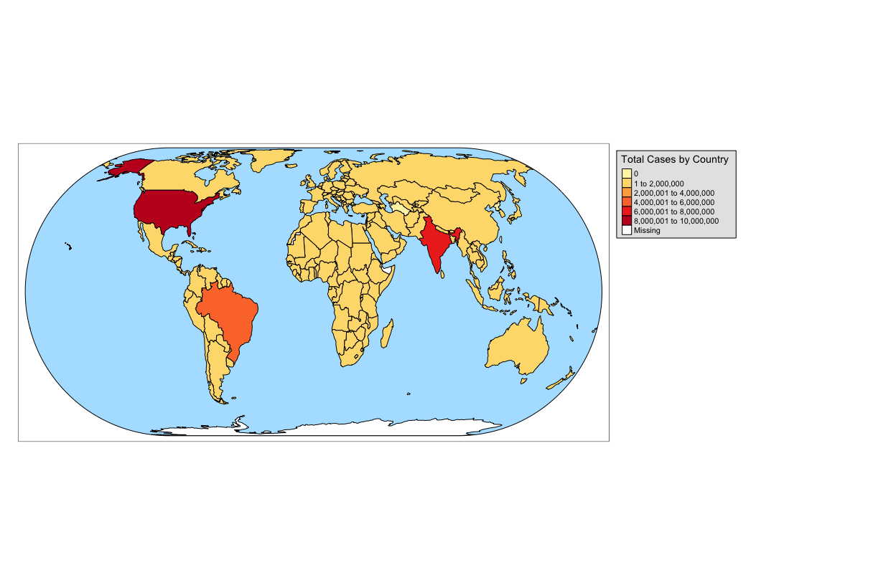
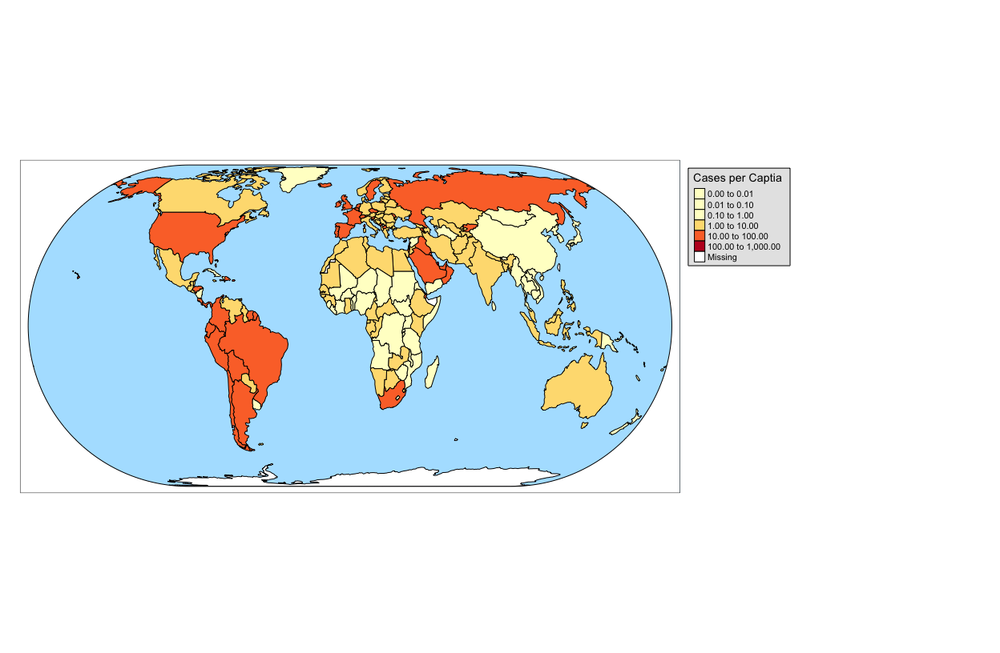
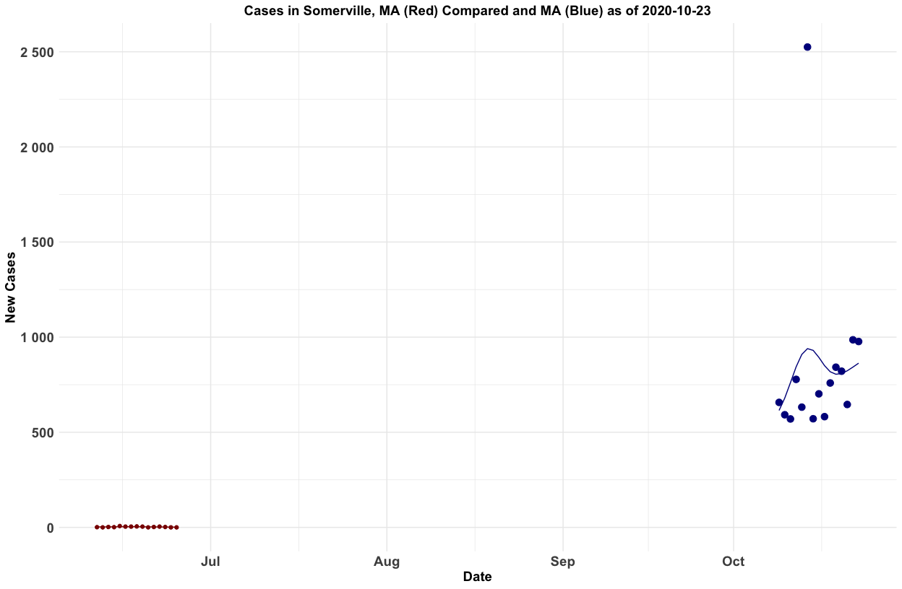
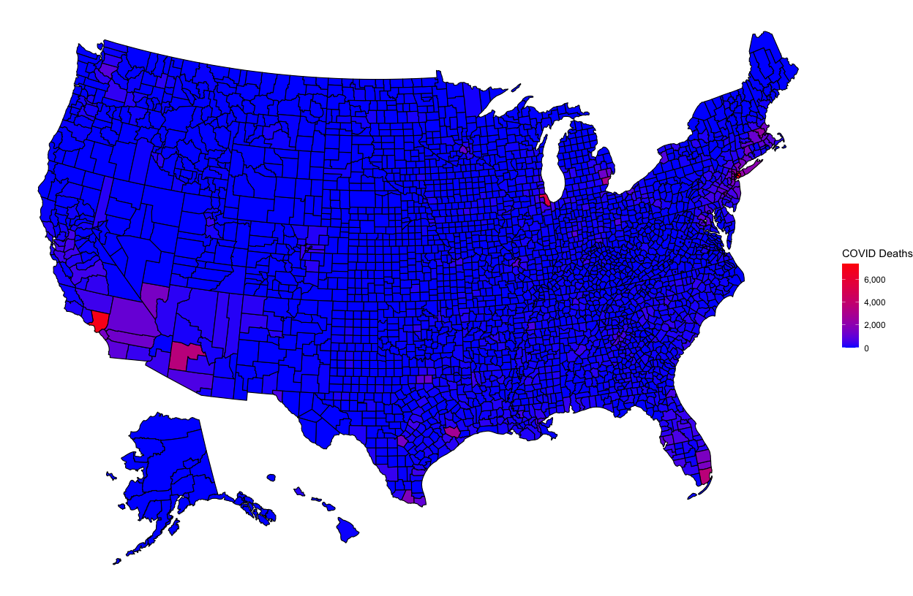
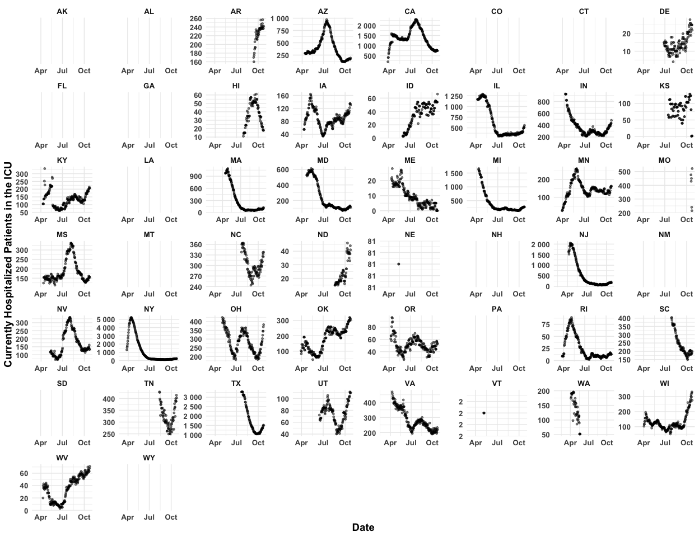

## Headline Numbers 
As of the latest CDC data release on August 04, 2020 there are:  

* 52,462 new cases
  + The state with the most cases is TX with 9,271
    - The county with the most cases is Los Angeles County in CA with 1,826 new cases 
  + The record number of national cases per day is 80,443 on July 16, 2020
* 1,351 new deaths
  +  The record number of deaths per day is 3,153 on April 14, 2020
  
Where I live, in Somerville, MA, as of August 03, 2020 there are:  

* 3 new cases  
* 89 cases in the last two weeks  
  + Out of 1,115 cases overall   
    - 37 Fatalities and
    - 1021 Recoveries

Where my grandparents live, in Collier County, FL, as of August 04, 2020 there are:

* 86 new cases
* 1,963 cases in the last two weeks
  + For a more detailed report, see <http://ww11.doh.state.fl.us/comm/_partners/covid19_report_archive/state_reports_latest.pdf>

Consequently, in the United States, there are now:   

* 4,732,988 total cases  
* 155,546 total deaths  

Globally, as of the latest WHO data release on August 05, 2020, there are: 

* 18,354,342 total cases
  + 206,709 today
* 696,147 total deaths
  + 5,116 today

## Overall Covid Cases In The USA

Regions are defined as follows: Northeast (CT, ME, MA, NH, RI, VT, NJ, NY, PA), Midwest (IN, IL, MI, OH, WI, IA, KS, MN, MO, NE, ND, SD), South (AL, AR, DC, DE, FL, GA, KY, LA, MD, MS, NC, OK, SC, TN, TX, VA, WV) and West (AZ, CO, ID,  NM, MT, UT, NV, WY, AK, CA, HI, OR, WA).  The red line denotes the date that Health and Human Services (HHS) took over the production of data from the Center for Disease Control (CDC) on July 20, 2020.^[See e.g., https://www.cnbc.com/2020/07/20/hhs-unveils-new-coronavirus-hospitalization-database-says-its-more-complete-than-cdcs.html]

<!-- -->

## US Cases Compared to World Cases
<!-- -->

## World Case Maps: Total Cases and Cases per Capita

<!-- --><!-- -->

## Covid Cases in Somerville, MA and MA
<!-- -->

## Latest Cases in Boston Area (Today, One Week Ago, Two Weeks Ago)

<table class="table table-striped table-hover" style="margin-left: auto; margin-right: auto;">
 <thead>
  <tr>
   <th style="text-align:left;"> Date </th>
   <th style="text-align:left;"> County Name </th>
   <th style="text-align:right;"> Cases </th>
   <th style="text-align:right;"> Deaths </th>
   <th style="text-align:right;"> New Cases </th>
   <th style="text-align:right;"> New Deaths </th>
  </tr>
 </thead>
<tbody>
  <tr>
   <td style="text-align:left;"> August 04, 2020 </td>
   <td style="text-align:left;"> Middlesex County </td>
   <td style="text-align:right;"> 26027 </td>
   <td style="text-align:right;"> 1989 </td>
   <td style="text-align:right;"> 95 </td>
   <td style="text-align:right;"> 1 </td>
  </tr>
  <tr>
   <td style="text-align:left;"> July 28, 2020 </td>
   <td style="text-align:left;"> Middlesex County </td>
   <td style="text-align:right;"> 25429 </td>
   <td style="text-align:right;"> 1961 </td>
   <td style="text-align:right;"> 33 </td>
   <td style="text-align:right;"> 2 </td>
  </tr>
  <tr>
   <td style="text-align:left;"> July 21, 2020 </td>
   <td style="text-align:left;"> Middlesex County </td>
   <td style="text-align:right;"> 25011 </td>
   <td style="text-align:right;"> 1946 </td>
   <td style="text-align:right;"> 53 </td>
   <td style="text-align:right;"> 0 </td>
  </tr>
  <tr>
   <td style="text-align:left;"> August 04, 2020 </td>
   <td style="text-align:left;"> Norfolk County </td>
   <td style="text-align:right;"> 10447 </td>
   <td style="text-align:right;"> 991 </td>
   <td style="text-align:right;"> 86 </td>
   <td style="text-align:right;"> 3 </td>
  </tr>
  <tr>
   <td style="text-align:left;"> July 28, 2020 </td>
   <td style="text-align:left;"> Norfolk County </td>
   <td style="text-align:right;"> 10034 </td>
   <td style="text-align:right;"> 977 </td>
   <td style="text-align:right;"> 21 </td>
   <td style="text-align:right;"> 0 </td>
  </tr>
  <tr>
   <td style="text-align:left;"> July 21, 2020 </td>
   <td style="text-align:left;"> Norfolk County </td>
   <td style="text-align:right;"> 9779 </td>
   <td style="text-align:right;"> 970 </td>
   <td style="text-align:right;"> 42 </td>
   <td style="text-align:right;"> 2 </td>
  </tr>
  <tr>
   <td style="text-align:left;"> August 04, 2020 </td>
   <td style="text-align:left;"> Suffolk County </td>
   <td style="text-align:right;"> 21481 </td>
   <td style="text-align:right;"> 1062 </td>
   <td style="text-align:right;"> 103 </td>
   <td style="text-align:right;"> 3 </td>
  </tr>
  <tr>
   <td style="text-align:left;"> July 28, 2020 </td>
   <td style="text-align:left;"> Suffolk County </td>
   <td style="text-align:right;"> 20960 </td>
   <td style="text-align:right;"> 1052 </td>
   <td style="text-align:right;"> 46 </td>
   <td style="text-align:right;"> 4 </td>
  </tr>
  <tr>
   <td style="text-align:left;"> July 21, 2020 </td>
   <td style="text-align:left;"> Suffolk County </td>
   <td style="text-align:right;"> 20650 </td>
   <td style="text-align:right;"> 1039 </td>
   <td style="text-align:right;"> 29 </td>
   <td style="text-align:right;"> 4 </td>
  </tr>
</tbody>
</table>

## New Covid Cases By State

The plot below shows the number of new COVID cases by state.  Note that each figure has its own y axis; this is done so that trends can be seen within each state.  Log scales can make the difference between 100 and 1000 cases hard to discern and a common y axis causes states like NY and CA to swamp states like NC.  Negative new cases can occur when States revise their total number of cases downwards, as Hawaii did between June 30, 2020 and July 1, 2020.

<!-- -->

## COVID Cases per 1,000 Residents by State

This figure shows the number of COVID cases per 1,000.

<!-- -->

## Latest County Case Map
<!-- -->

## Latest County Death Map
<!-- -->

## Counties with the Most Cases Over Time
<table class="table table-striped table-hover" style="margin-left: auto; margin-right: auto;">
 <thead>
  <tr>
   <th style="text-align:left;"> Date </th>
   <th style="text-align:left;"> State </th>
   <th style="text-align:left;"> County Name </th>
   <th style="text-align:right;"> Cases </th>
   <th style="text-align:right;"> Deaths </th>
  </tr>
 </thead>
<tbody>
  <tr>
   <td style="text-align:left;"> 2020-08-04 </td>
   <td style="text-align:left;"> CA </td>
   <td style="text-align:left;"> Los Angeles County </td>
   <td style="text-align:right;"> 195614 </td>
   <td style="text-align:right;"> 4758 </td>
  </tr>
  <tr>
   <td style="text-align:left;"> 2020-08-04 </td>
   <td style="text-align:left;"> FL </td>
   <td style="text-align:left;"> Miami-Dade County </td>
   <td style="text-align:right;"> 124759 </td>
   <td style="text-align:right;"> 1724 </td>
  </tr>
  <tr>
   <td style="text-align:left;"> 2020-08-04 </td>
   <td style="text-align:left;"> AZ </td>
   <td style="text-align:left;"> Maricopa County </td>
   <td style="text-align:right;"> 121789 </td>
   <td style="text-align:right;"> 2153 </td>
  </tr>
  <tr>
   <td style="text-align:left;"> 2020-08-04 </td>
   <td style="text-align:left;"> IL </td>
   <td style="text-align:left;"> Cook County </td>
   <td style="text-align:right;"> 107744 </td>
   <td style="text-align:right;"> 4902 </td>
  </tr>
  <tr>
   <td style="text-align:left;"> 2020-08-04 </td>
   <td style="text-align:left;"> TX </td>
   <td style="text-align:left;"> Harris County </td>
   <td style="text-align:right;"> 78105 </td>
   <td style="text-align:right;"> 1367 </td>
  </tr>
  <tr>
   <td style="text-align:left;"> 2020-08-01 </td>
   <td style="text-align:left;"> CA </td>
   <td style="text-align:left;"> Los Angeles County </td>
   <td style="text-align:right;"> 190693 </td>
   <td style="text-align:right;"> 4669 </td>
  </tr>
  <tr>
   <td style="text-align:left;"> 2020-08-01 </td>
   <td style="text-align:left;"> FL </td>
   <td style="text-align:left;"> Miami-Dade County </td>
   <td style="text-align:right;"> 121207 </td>
   <td style="text-align:right;"> 1647 </td>
  </tr>
  <tr>
   <td style="text-align:left;"> 2020-08-01 </td>
   <td style="text-align:left;"> AZ </td>
   <td style="text-align:left;"> Maricopa County </td>
   <td style="text-align:right;"> 119295 </td>
   <td style="text-align:right;"> 2089 </td>
  </tr>
  <tr>
   <td style="text-align:left;"> 2020-08-01 </td>
   <td style="text-align:left;"> IL </td>
   <td style="text-align:left;"> Cook County </td>
   <td style="text-align:right;"> 106131 </td>
   <td style="text-align:right;"> 4888 </td>
  </tr>
  <tr>
   <td style="text-align:left;"> 2020-08-01 </td>
   <td style="text-align:left;"> TX </td>
   <td style="text-align:left;"> Harris County </td>
   <td style="text-align:right;"> 72964 </td>
   <td style="text-align:right;"> 1288 </td>
  </tr>
  <tr>
   <td style="text-align:left;"> 2020-07-01 </td>
   <td style="text-align:left;"> CA </td>
   <td style="text-align:left;"> Los Angeles County </td>
   <td style="text-align:right;"> 105507 </td>
   <td style="text-align:right;"> 3402 </td>
  </tr>
  <tr>
   <td style="text-align:left;"> 2020-07-01 </td>
   <td style="text-align:left;"> IL </td>
   <td style="text-align:left;"> Cook County </td>
   <td style="text-align:right;"> 90911 </td>
   <td style="text-align:right;"> 4581 </td>
  </tr>
  <tr>
   <td style="text-align:left;"> 2020-07-01 </td>
   <td style="text-align:left;"> NY </td>
   <td style="text-align:left;"> Queens County </td>
   <td style="text-align:right;"> 65455 </td>
   <td style="text-align:right;"> 7059 </td>
  </tr>
  <tr>
   <td style="text-align:left;"> 2020-07-01 </td>
   <td style="text-align:left;"> NY </td>
   <td style="text-align:left;"> Kings County </td>
   <td style="text-align:right;"> 59742 </td>
   <td style="text-align:right;"> 7104 </td>
  </tr>
  <tr>
   <td style="text-align:left;"> 2020-07-01 </td>
   <td style="text-align:left;"> AZ </td>
   <td style="text-align:left;"> Maricopa County </td>
   <td style="text-align:right;"> 52266 </td>
   <td style="text-align:right;"> 817 </td>
  </tr>
  <tr>
   <td style="text-align:left;"> 2020-06-01 </td>
   <td style="text-align:left;"> IL </td>
   <td style="text-align:left;"> Cook County </td>
   <td style="text-align:right;"> 78495 </td>
   <td style="text-align:right;"> 3658 </td>
  </tr>
  <tr>
   <td style="text-align:left;"> 2020-06-01 </td>
   <td style="text-align:left;"> NY </td>
   <td style="text-align:left;"> Queens County </td>
   <td style="text-align:right;"> 62094 </td>
   <td style="text-align:right;"> 6271 </td>
  </tr>
  <tr>
   <td style="text-align:left;"> 2020-06-01 </td>
   <td style="text-align:left;"> NY </td>
   <td style="text-align:left;"> Kings County </td>
   <td style="text-align:right;"> 56053 </td>
   <td style="text-align:right;"> 6742 </td>
  </tr>
  <tr>
   <td style="text-align:left;"> 2020-06-01 </td>
   <td style="text-align:left;"> CA </td>
   <td style="text-align:left;"> Los Angeles County </td>
   <td style="text-align:right;"> 55968 </td>
   <td style="text-align:right;"> 2362 </td>
  </tr>
  <tr>
   <td style="text-align:left;"> 2020-06-01 </td>
   <td style="text-align:left;"> NY </td>
   <td style="text-align:left;"> Bronx County </td>
   <td style="text-align:right;"> 45359 </td>
   <td style="text-align:right;"> 4480 </td>
  </tr>
</tbody>
</table>

## Hospitalizations By State

<!-- -->

## Patients Currently in the ICU

<!-- -->

## Patients Currently on Ventilators 

<!-- -->

## Cumulative Cases by County in the Northeast
<!-- -->

## Cumulative Cases by State Over Time

<!-- -->

## Cumulative Deaths by State Over Time

<!-- -->

## Daily Percent Positive Cases 

According to the WHO the positive rate should be below 5%.^[https://coronavirus.jhu.edu/testing/tracker/overview]  Days above the threshold are denoted in red, days below are in blue.  Note that the variables currently used for these plots --positiveIncrease and negativeIncrease-- are being phased out and will be replaced by positiveCasesViral and negativeCasesViral.  Each dot represents the rolling average of tests within the previous week (this approach smoothes out trends such as fewer cases being reported on weekends).

<!-- -->

## Partisanship and COVID Cases

<!-- -->

# Variants of Select Figures

## Week to Week Changes in COVID Cases

<!-- -->

## Confirmed Cases as a Percentage of State Population

The two sets of points are confirmed cases (black), and potential cases (grey) which are confirmed cases times ten.  For herd immunity, typically 70-90% of a population needs immunity.^[See <https://www.jhsph.edu/covid-19/articles/achieving-herd-immunity-with-covid19.html>]

<!-- -->

## Data Sources

Data for this report comes from:

* The CDC Homepage <https://www.cdc.gov/covid-data-tracker/index.html#county-map> and <https://usafacts.org/visualizations/coronavirus-covid-19-spread-map/>, specifically:
    + Confirmed COVID Cases <https://usafactsstatic.blob.core.windows.net/public/data/covid-19/covid_confirmed_usafacts.csv>
    + Covid Deaths <https://usafactsstatic.blob.core.windows.net/public/data/covid-19/covid_deaths_usafacts.csv>
    + County Population <https://usafactsstatic.blob.core.windows.net/public/data/covid-19/covid_county_population_usafacts.csv>
* Covidtracker.com data (used by Johns Hopkins <https://coronavirus.jhu.edu/us-map>) <https://covidtracking.com/api/v1/states/daily.csv>
* World Health Organization <https://covid19.who.int/>
* Somerville City data <https://somerville-dashboardcovid.trial.opendatasoft.com/pages/citysdashboard/>

## Different Counts from Different Data

See the difference between <https://covidtracking.com/api/v1/states/daily.csv> and <https://usafacts.org/visualizations/coronavirus-covid-19-spread-map/>

<!-- -->

